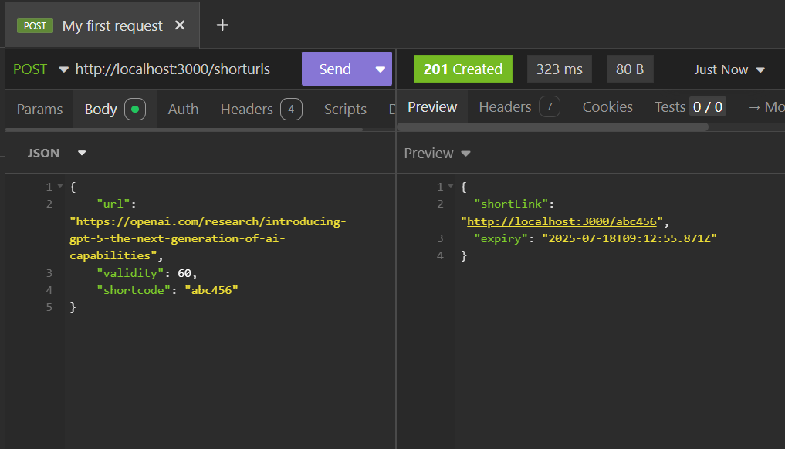
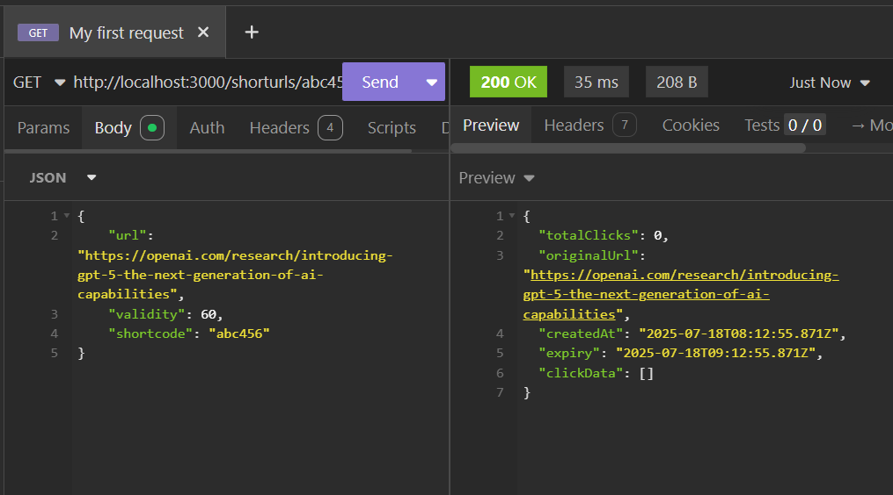

# URL Shortener Microservice 

This is a functional **URL Shortener Backend API**, designed for placement evaluations and learning.  
It can:

- Generate short URLs (custom or random shortcodes)
- Redirect to original URLs
- Track and retrieve statistics like total clicks and click history
- Log all major actions to an external **Logging API**

---

## Technologies Used

- **Node.js**
- **Express.js**
- **Axios** (for external logging API)

---

## How to Run

1. **Clone the Repository or Copy the Files**

2. **Install dependencies**
> npm install axios express
3. **Start the Server**
> npm start
4.  **Server will start on**
   http://localhost:3000

## Screenshots

